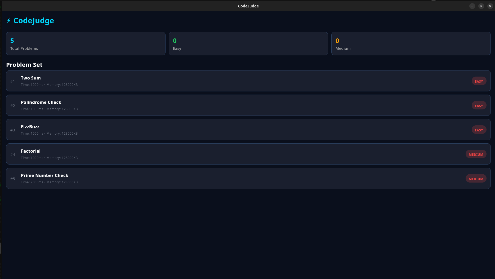
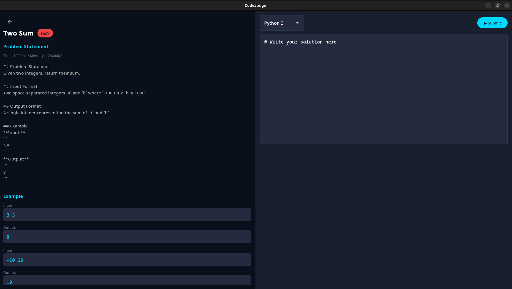
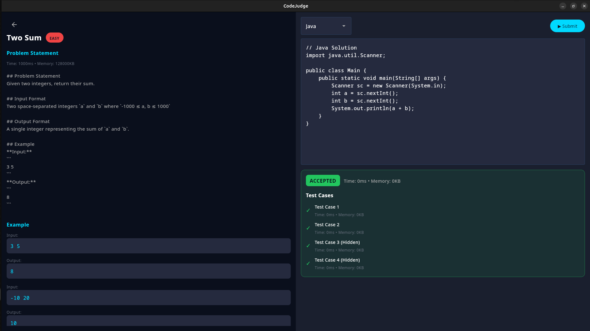
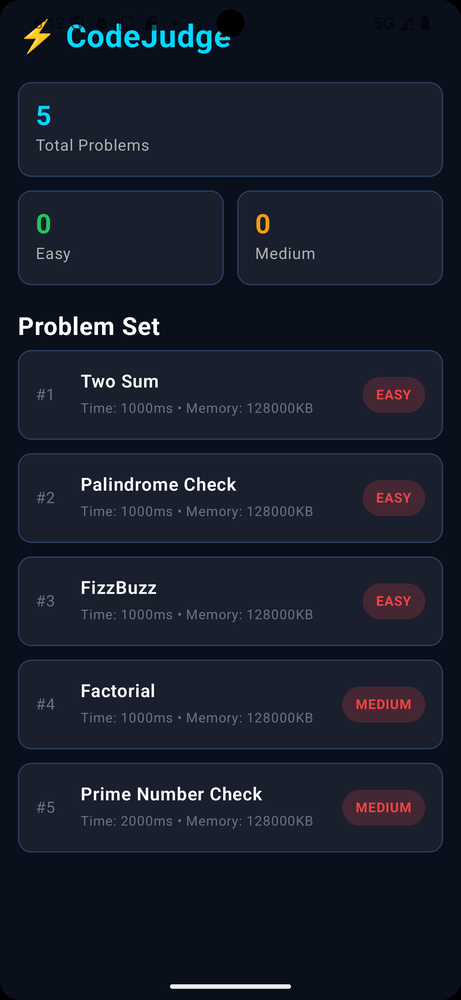
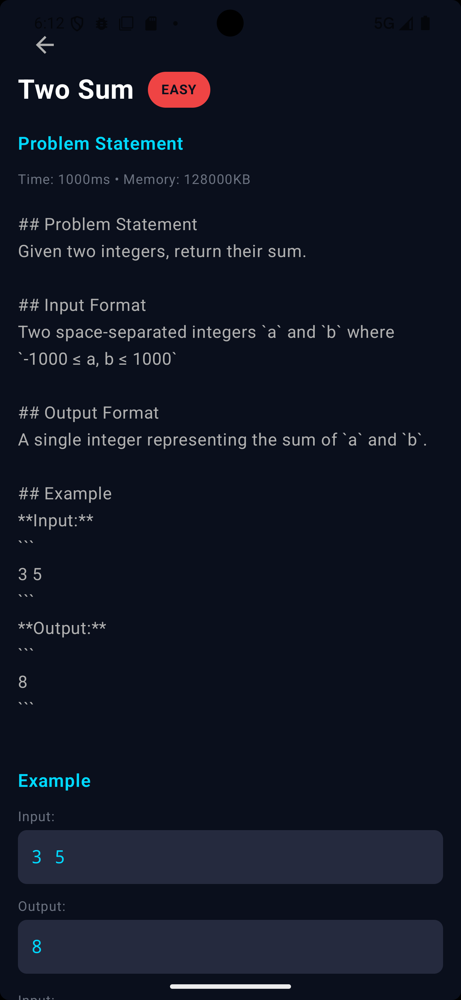
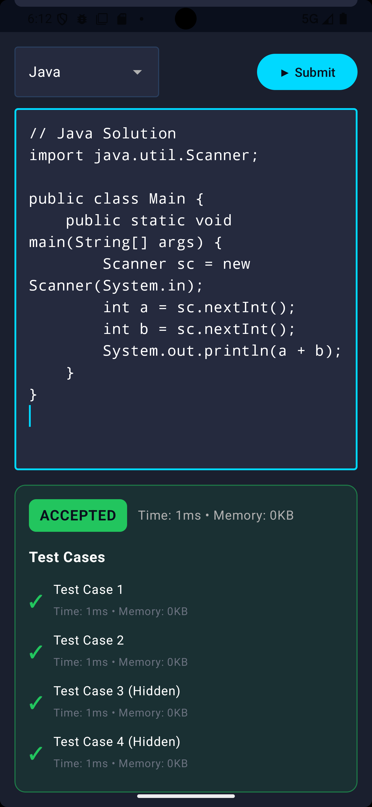

# 📱 CodeJudge KMP - Multi-platform App

This is the **CodeJudge Mobile and Desktop app**. It lets you solve programming problems on your Android phone or your Computer (Windows/Linux/macOS) using the exact same app!

This app uses **Kotlin Multiplatform (KMP)**, which means we write the code once, and it runs everywhere.


---

## 📸 Screenshots

### 🖥️ Desktop (Windows/Linux/macOS)

#### Problem List & Challenges


#### Code Editor with Dark Theme


#### Success Verdict


### 📱 Android App

#### Mobile Home Screen


#### Coding on Mobile (Portrait)


#### Submission Accepted!


---

## ✨ Features

- **📱 Android App**: Native performance on your phone.
- **💻 Desktop App**: Same app running on your Laptop or PC.
- **🎨 Dark Mode**: Easy on the eyes, matching the web version.
- **📏 Adaptive Layout**: The app "stretches" or "shrinks" perfectly for any screen size.
- **⚡ Fast & Lite**: Quick to open and sub-second code submissions.

---

## 🛠️ Getting Started

Before running this app, you **must** have the [CodeJudge Backend Server](https://github.com/jamilxt/online-judge) running.

### 1. Requirements

- **Java 17+**: Required to build the app.
- **Android Studio** (Optional): Only if you want to run it on an Android emulator or phone.

### 2. Running on Desktop (Fastest)

Open your terminal in this folder and run:

```bash
./gradlew :composeApp:run
```

### 3. Running on Android

1. Open this folder in **Android Studio**.
2. Wait for the project to load (sync).
3. Select an emulator or plug in your phone.
4. Press the green **Run** button.

> [!NOTE]
> If you are using an Android emulator, it will automatically look for the backend at `http://10.0.2.2:8081`.

---

## 🔗 How it Works

The app works as a "Client". It talks to the **CodeJudge Backend** to fetch problems and submit your code.

- **Frontend (This project)**: The beautiful UI you see and interact with.
- **Backend ([online-judge](https://github.com/jamilxt/online-judge))**: The "Brain" that stores problems and actually runs your code safely.

---

## 🚀 Check out the Backend

The backend is where all the magic happens! It's built with Spring Boot and supports Local or Docker execution modes.

👉 **[Go to Backend Repository](https://github.com/jamilxt/online-judge)**

---

## 👨 Developed By

<a href="https://twitter.com/jamil_xt" target="_blank">
  
</a>

**Md Jamilur Rahman**

[](https://twitter.com/jamil_xt)
[](https://medium.com/@jamilxt)
[](https://www.linkedin.com/in/jamilxt/)
[](https://jamilxt.com/)
